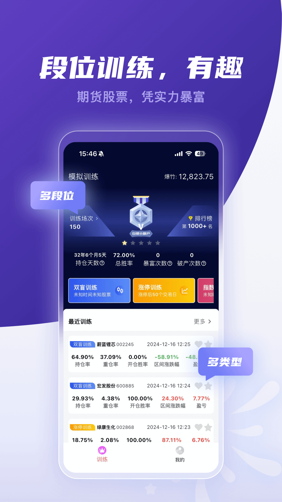
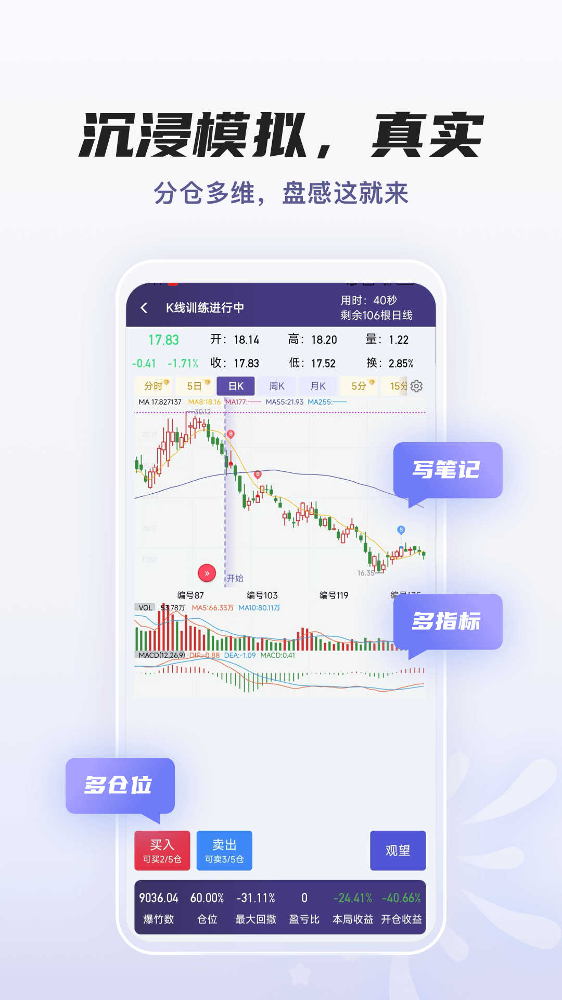

<div align="center">

# 📈 KlineTrain · K线训练助手

**真实历史行情回放 + 模拟交易训练的 Android App**

复盘千次，不如实战一次；实战千次，不如先在这里亏一万次。

[](https://github.com/pangzhongyu666/KlineTrain/actions/workflows/android-ci.yml)
[](https://github.com/pangzhongyu666/KlineTrain/releases)
[](LICENSE)


[功能特性](#-功能特性) · [下载安装](#-下载安装) · [构建](#-从源码构建) · [架构](#-项目架构) · [贡献](#-参与贡献)

</div>

---

## ✨ 功能特性

### 🎯 全品类训练模式
| 模式 | 说明 |
|------|------|
| **双盲训练** | 隐藏股票名称与日期，纯K线技术训练 |
| **涨停专项** | 定位真实涨停日，回放其后 50 个交易日 |
| **指数训练** | 上证 / 深证 / 创业板 / 科创50 / 中证500 等 |
| **ETF 训练** | 宽基与行业 ETF（沪深300 / 半导体 / 证券 / 黄金…） |
| **币圈训练** | BTC / ETH 及任意自定义币种，7×24 真实币价 |

### 💰 专业交易模拟
- **分仓操作**：总仓数 2/3/5/10 可切换，每次开仓仓数可设，模拟真实持仓管理
- **多空双向** + **1~10 倍杠杆**，适配期货等品种
- **止盈止损**：按价格涨跌幅自动平仓
- **金钱赛季体系**：每局以当前金钱全额入场；达到初始金额 **100 倍=暴富** 🎉，跌到 **5%=破产** 💥 重置开新赛季
- **王者式段位**：青铜→白银→黄金→铂金→钻石→大师→王者，一局盈利 ≥5% 升一星、亏损 ≥5% 掉一星
- 市场（主板/创业板/科创板）、训练时段（近1年/5年/自定义）、去除ST 自由定制
- 真实历史行情回放，零资金风险

### 📊 看盘与分析工具
- **真实历史数据**：腾讯行情（A股/指数/ETF）+ Binance/OKX（加密货币），本地缓存 + 离线合成兜底
- **全周期切换**：分时、5/15/30/60 分钟、日/周/月K；历史K线可无限左滑增量加载
- **筹码分布**：与主图同价格轴的独立分布面板，获利盘/套牢盘一目了然
- **十余种技术指标**：MA / EMA / BOLL / MACD / KDJ / RSI / ATR / CCI + 成交量，任意叠加
- **自定义公式指标**：通达信风格 DSL（`MA` `EMA` `REF` `HHV` `CROSS` `IF` …），自由编写、即时校验
- **K线个性化**：空心阳/实心阳/折线/竹节 4 种样式，普通/对数/百分比坐标，最新价线、成本线、涨停黄跌停蓝、绿涨红跌…

### 📝 战法复盘与成长
- **战法系统**：创建专属战法，交易记录自动归入，分战法统计胜率与盈亏比
- **智能复盘**：自动分析每笔交易（频繁交易 / 止损不及时 / 跑赢大盘…）
- **复盘笔记**：每局训练可记录心得，持续沉淀交易体系
- **详细数据页**：赛季化战绩、金钱数量曲线、交易历史、一键 CSV 导出
- **训练详情**：完整K线回放图 + B/S 买卖点标记

## 📱 界面预览

| 首页 | K线训练 | 记录 |
|:---:|:---:|:---:|
|  |  |  |

> 以上为设计参考图，实际界面以 App 为准。

## 📦 下载安装

前往 [Releases](https://github.com/pangzhongyu666/KlineTrain/releases) 下载最新 APK 直接安装。

- 系统要求：Android 8.0 (API 26) 及以上
- 权限：仅需网络权限（拉取历史行情），无任何数据上传

## 🔨 从源码构建

```bash
git clone https://github.com/pangzhongyu666/KlineTrain.git
cd KlineTrain

# Windows
gradlew.bat assembleDebug
# Linux / macOS
./gradlew assembleDebug

# 产物: app/build/outputs/apk/debug/app-debug.apk
```

环境要求：JDK 17+、Android SDK 36（首次构建自动下载依赖，已配置阿里云镜像加速）。

## 🏗 项目架构

```
app/src/main/java/com/klinetrain/app/
├── data/            # 数据层
│   ├── model/       #   数据模型 (Kline/Stock/ChartStyle/RankSystem…)
│   ├── db/          #   Room 数据库 (训练记录/交易/战法/公式/行情缓存)
│   ├── net/         #   行情接口 (腾讯 / Binance / OKX)
│   ├── StockRepositoryImpl.kt   # 网络 → 缓存 → 离线合成 三级降级
│   └── SyntheticData.kt         # 确定性合成行情(离线兜底)
├── engine/          # 分仓交易引擎 (多空/杠杆/手续费/权益曲线/结算)
├── indicator/       # 技术指标纯函数 (MA/MACD/KDJ/RSI/BOLL/筹码分布…)
├── formula/         # 通达信风格公式引擎 (词法/递归下降解析/序列求值)
└── ui/
    ├── chart/       # Canvas K线图表 (蜡烛/指标/十字线/手势/筹码)
    ├── training/    # 训练页 (回放/交易/结算)
    ├── home/ profile/ records/ season/ strategy/ formula/ setup/ settings/
    └── theme/
```

**技术栈**：Kotlin 2.0 · Jetpack Compose (Material 3) · Room · OkHttp · Gson · Navigation Compose

## 🤝 参与贡献

欢迎 Issue 与 PR！

1. Fork 本仓库并创建分支：`git checkout -b feature/xxx`
2. 提交前确认构建与测试通过：`gradlew assembleDebug testDebugUnitTest`
3. 发起 Pull Request，描述清楚改动动机与效果

发现 Bug 请使用 [Issue 模板](https://github.com/pangzhongyu666/KlineTrain/issues/new/choose) 提交。

## ⚠️ 免责声明

本项目仅供 **K线技术学习与模拟训练** 使用，不构成任何投资建议。行情数据来自公开接口，仅用于个人学习研究。股市有风险，投资需谨慎。

## 📄 开源协议

本项目基于 [MIT License](LICENSE) 开源。

## 友情链接
[LINUX DO](https://linux.do/) — 新的理想型社区